# MissionControl

A visual multi-agent orchestration system where a **King** agent coordinates **worker** agents through a **6-phase workflow**. Workers spawn, complete tasks, and die. Context lives in files, not conversation memory.

Inspired by [Vibecraft](https://vibecraft.dev), [Ralv](https://ralv.dev), and [Gastown](https://gastown.dev).

## Architecture


**Key insight:** King IS a Claude Code session with a good system prompt. Go bridge spawns processes and relays events — no custom LLM API calls.

## Key Concepts

### King Agent
The King is the only persistent agent. It talks to you, decides what to build, spawns workers, and approves phase gates. It never implements directly.

### Workers
Workers are ephemeral. They receive a **briefing** (~300 tokens), do their task, output **findings**, and die. This keeps context lean and costs low.

### 6-Phase Workflow

```mermaid
stateDiagram-v2
    direction LR
    [*] --> IDEA
    IDEA --> DESIGN : ✓ Gate
    DESIGN --> IMPLEMENT : ✓ Gate
    IMPLEMENT --> VERIFY : ✓ Gate
    VERIFY --> DOCUMENT : ✓ Gate
    DOCUMENT --> RELEASE : ✓ Gate
    RELEASE --> [*]
```



Each phase has a **gate** requiring approval before proceeding.

### Zones
Zones organize the codebase (Frontend, Backend, Database, Infra, Shared). Workers are assigned to zones and stay in their lane.

## Status

| Version | Status | Description |
|---------|--------|-------------|
| v1 | ✅ Done | Python agent fundamentals |
| v2 | ✅ Done | Go orchestrator + Rust parser |
| v3 | ✅ Done | Full 2D dashboard (81 tests) |
| v4 | ✅ Done | Rust core (workflow, knowledge, health) |
| v5 | ✅ Done | King orchestration + mc CLI (64 tests) |
| v6 | 📋 Planned | 3D visualization + polish |

## Stack

| Component | Language | Purpose |
|-----------|----------|---------|
| **Agents** | Python | Custom agents, educational |
| **mc CLI** | Go | MissionControl CLI commands |
| **Orchestrator** | Go | Process management, REST, WebSocket |
| **mc-core** | Rust | Validation, token counting, gate checking |
| **Core** | Rust | Workflow engine, knowledge manager (v4) |
| **Strategy** | Claude Opus | King agent (v5) |
| **Workers** | Claude Sonnet/Haiku | Task execution |
| **UI** | React | Dashboard with Zustand state |

- **81 Unit Tests** — 29 Go + 52 React

## Installation

### From Source (Recommended)

```bash
git clone https://github.com/DarlingtonDeveloper/MissionControl.git
cd MissionControl

# Build all components
make build

# Install to /usr/local/bin (macOS)
make install
```

### Homebrew (Coming Soon)

```bash
brew tap DarlingtonDeveloper/tap
brew install mission-control
```

## Quick Start

### Python Agents (v1)

```bash
cd agents
pip install anthropic
export ANTHROPIC_API_KEY="your-key"

# Minimal agent (~50 lines, bash only)
python3 v0_minimal.py "list files in current directory"

# Full agent (~200 lines, read/write/edit)
python3 v1_basic.py "create a hello world script"

# With task planning (~300 lines)
python3 v2_todo.py "build a calculator"

# With subagent delegation (~450 lines)
python3 v3_subagent.py "build a todo app with tests"
```

### mc CLI (v5)

```bash
# Build the mc CLI
cd cmd/mc
go build -o mc .

# Initialize a project
cd /path/to/your/project
mc init

# Check status
mc status

# Create a task
mc task create "Build login form" --phase implement --zone frontend --persona developer

# Check gate status
mc gate check idea

# Approve gate and transition
mc gate approve idea

# List workers
mc workers
```

### Orchestrator (v2+)

```bash
# Start orchestrator with mission support
cd orchestrator
go run . --workdir /path/to/project

# Start King via API
curl -X POST localhost:8080/api/king/start

# Send message to King
curl -X POST localhost:8080/api/king/message \
  -H "Content-Type: application/json" \
  -d '{"content": "Build a todo app"}'

# Check King status
curl localhost:8080/api/king/status

# Check gate via API
curl localhost:8080/api/mission/gates/idea

# Approve gate via API
curl -X POST localhost:8080/api/mission/gates/idea/approve

# Spawn agents via API
curl -X POST localhost:8080/api/agents \
  -H "Content-Type: application/json" \
  -d '{"type": "claude-code", "task": "review hello.py", "workingDir": "."}'
```

## v5 Features

- **mc CLI** — Command-line tool for MissionControl orchestration
  - `mc init` — Create `.mission/` scaffold with King + worker prompts
  - `mc status` — JSON dump of phase, tasks, workers, gates
  - `mc phase` — Get/set current workflow phase
  - `mc task` — Create, list, update tasks
  - `mc spawn` — Spawn Claude Code worker process
  - `mc kill` — Kill worker process
  - `mc handoff` — Validate and store worker handoff (supports `--rust` flag)
  - `mc gate` — Check/approve phase gates
  - `mc workers` — List active workers with health check
- **mc-core** — Rust CLI for validation and token counting
  - `mc-core validate-handoff <file>` — Schema + semantic validation
  - `mc-core check-gate <phase>` — Gate criteria evaluation
  - `mc-core count-tokens <file>` — Fast token counting with tiktoken
- **Go Bridge** — WebSocket events for real-time state sync
  - File watcher on `.mission/state/`
  - King process management (start, stop, message)
  - Automatic event broadcast on state changes
- **React UI Updates**
  - King status indicator with start/stop controls
  - Workers panel showing active/completed/errored workers
  - Findings viewer with type filtering
  - v5 WebSocket event handlers
- **King as Claude Code** — King IS a Claude Code session with CLAUDE.md prompt
- **64 Tests** — 8 Go CLI + 56 Rust core tests

## v3 Features

- **Zone System** — Create, edit, split, merge zones; move agents between zones
- **Persona System** — 4 default personas + custom creation
- **King Mode** — UI shell with KingPanel, TeamOverview
- **Attention System** — Notifications with quick response buttons
- **Settings** — General, Personas, Shortcuts tabs
- **Keyboard Shortcuts** — ⌘N spawn, ⌘K kill, ⌘⇧K king mode, etc.

## Development

```bash
# Build all
make build

# Run tests
make test

# Start dev environment
make dev
```

See [ARCHITECTURE.md](./ARCHITECTURE.md) for detailed system documentation.
See [CONTRIBUTING.md](./CONTRIBUTING.md) for development setup.