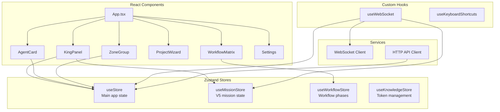
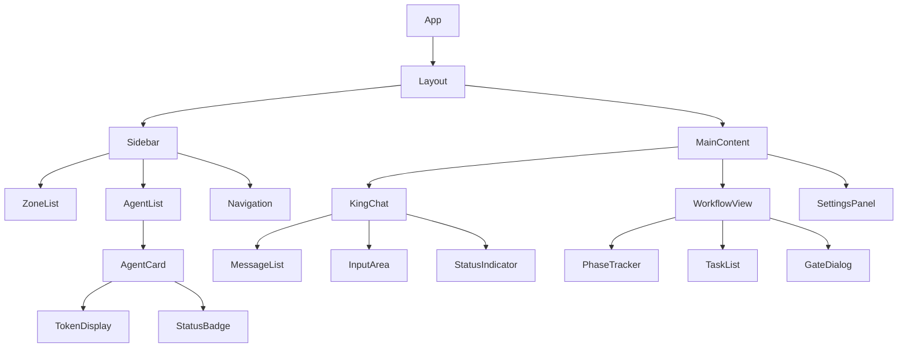
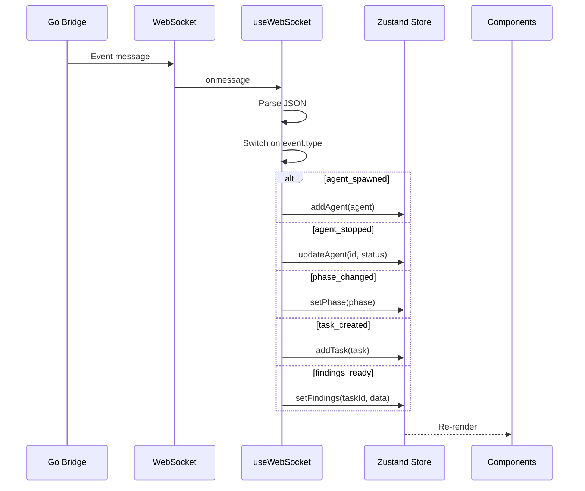
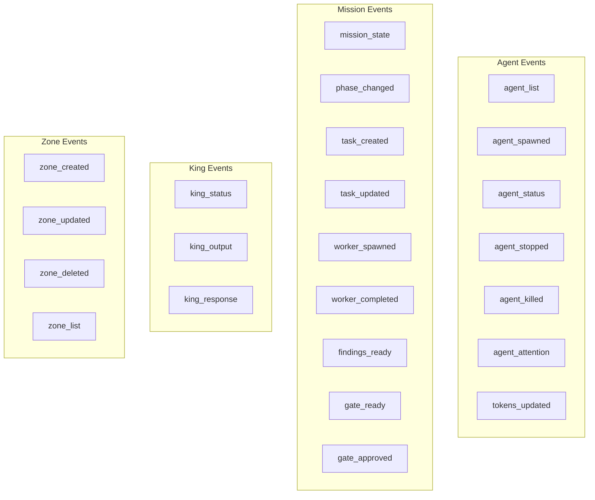
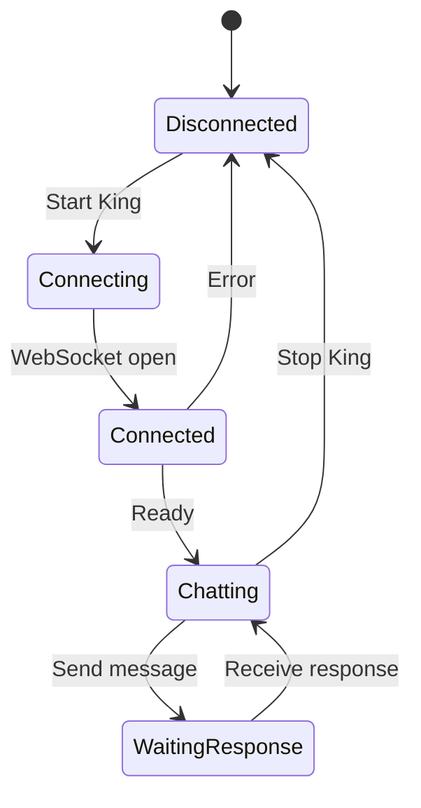
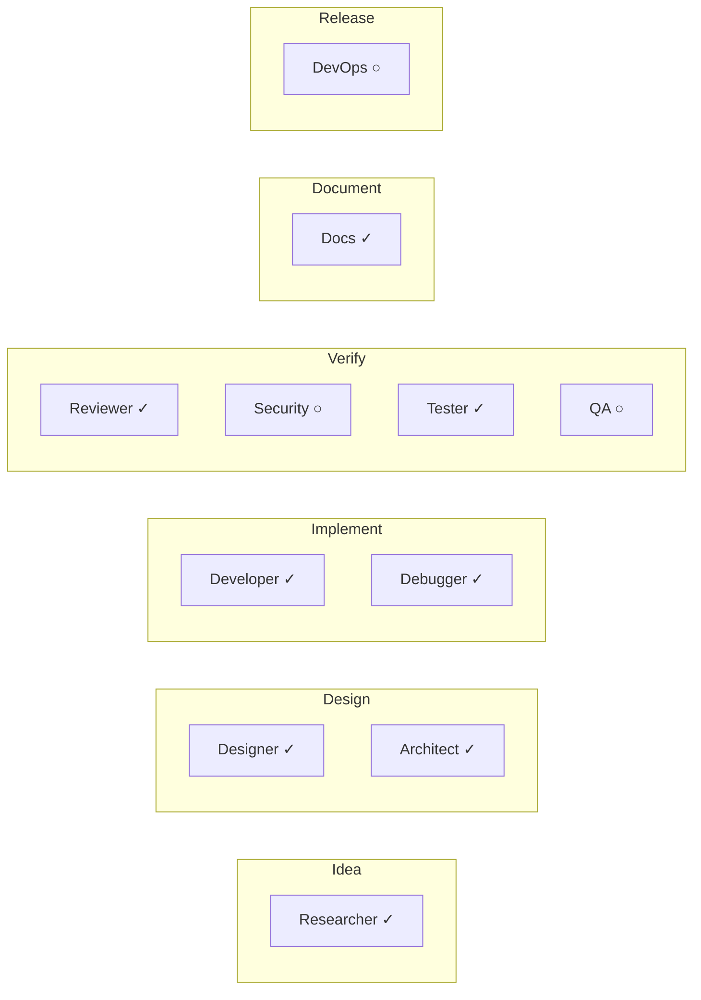
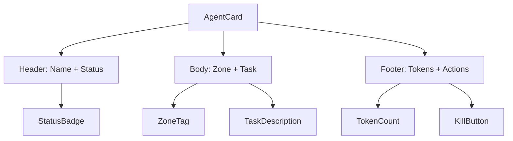
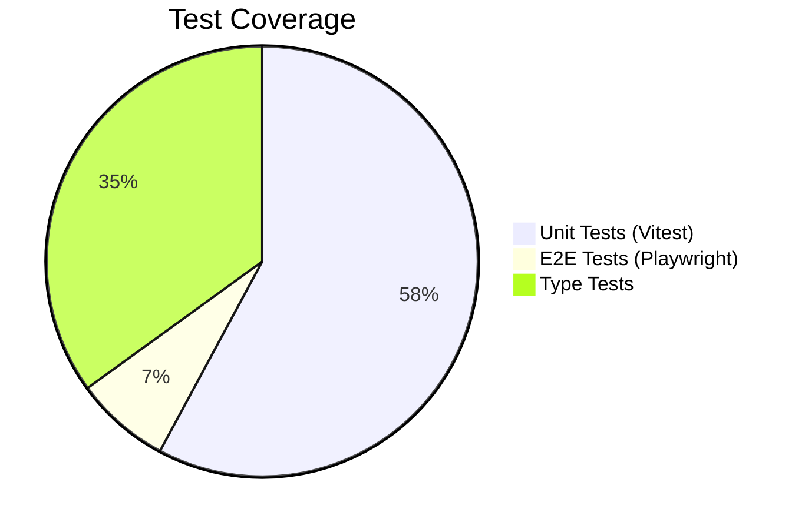
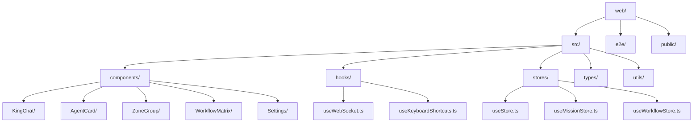
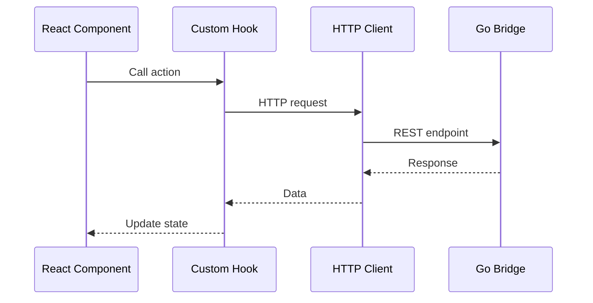

# MissionControl Web UI

React-based dashboard for MissionControl agent orchestration.

## Architecture



## Component Hierarchy



## State Management

```mermaid
flowchart LR
    subgraph Zustand["Zustand Stores"]
        direction TB
        A[useStore]
        B[useMissionStore]
        C[useWorkflowStore]
        D[useKnowledgeStore]
    end

    subgraph useStore["Main Store"]
        agents[agents: Agent[]]
        zones[zones: Zone[]]
        messages[messages: Message[]]
        connection[connectionStatus]
    end

    subgraph useMissionStore["Mission Store"]
        phase[currentPhase]
        tasks[tasks: Task[]]
        workers[workers: Worker[]]
        gates[gates: Gate[]]
        findings[findings]
    end

    subgraph useWorkflowStore["Workflow Store"]
        personas[personas: Persona[]]
        enabled[enabledPersonas]
        matrix[workflowMatrix]
    end

    A --> useStore
    B --> useMissionStore
    C --> useWorkflowStore
```

## WebSocket Event Handling



### Handled Event Types



## Key Components

### KingChat



### WorkflowMatrix

Shows persona availability per phase:



### AgentCard



## Development

```bash
# Install dependencies
npm install

# Start dev server (connects to orchestrator at localhost:8080)
npm run dev

# Run tests
npm test

# Run E2E tests (requires running orchestrator)
npm run test:e2e

# Build for production
npm run build

# Lint
npm run lint
```

## Testing Strategy



### Unit Tests

```bash
npm test
npm run test:coverage
```

### E2E Tests

```bash
# Start backend first
cd .. && make dev

# Run E2E tests
npm run test:e2e
```

## File Structure



## Keyboard Shortcuts

| Shortcut | Action |
|----------|--------|
| `⌘N` | Spawn agent |
| `⌘K` | Kill agent |
| `⌘⇧K` | Toggle King mode |
| `⌘,` | Open settings |
| `⌘/` | Show shortcuts |
| `Escape` | Close dialogs |

## API Integration



### Endpoints Used

| Method | Endpoint | Component |
|--------|----------|-----------|
| POST | /api/agents | SpawnDialog |
| DELETE | /api/agents/:id | AgentCard |
| POST | /api/king/start | KingPanel |
| POST | /api/king/stop | KingPanel |
| POST | /api/king/message | KingChat |
| GET | /api/zones | ZoneList |
| POST | /api/mission/gates/:phase/approve | GateDialog |

## Build Configuration

- **Framework**: React 18 + TypeScript + Vite
- **Styling**: Tailwind CSS
- **State**: Zustand
- **Testing**: Vitest + Playwright
- **Linting**: ESLint + Prettier